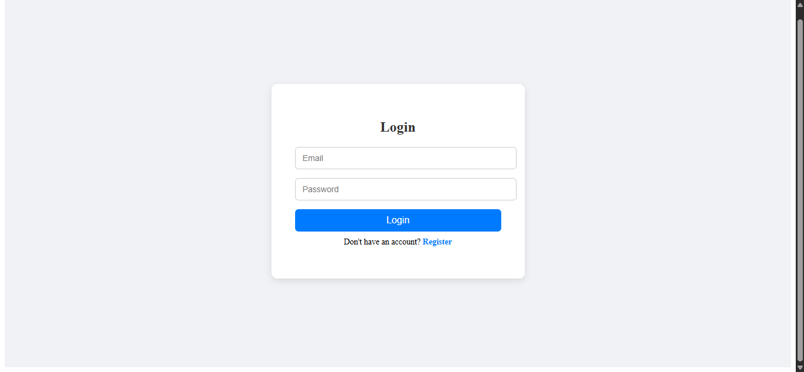
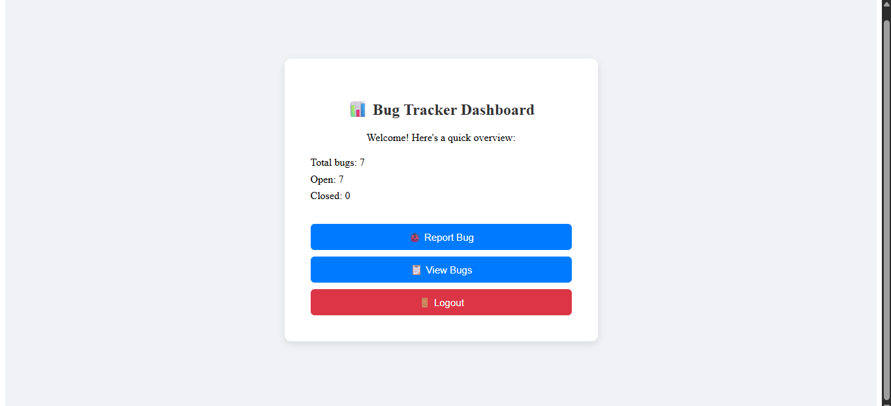
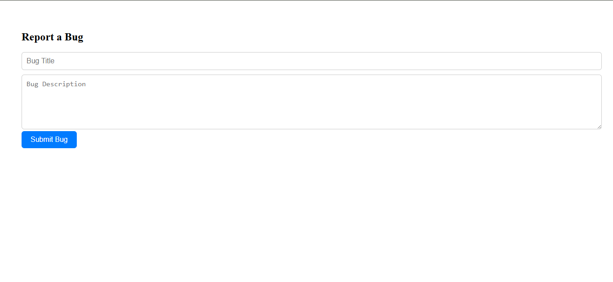
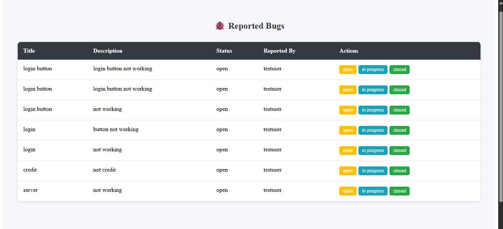

# 🐞 Bug Tracker App

A full-stack bug tracking system built with the **MERN stack**. This project helps developers or teams efficiently track and manage bugs throughout a software development cycle. It includes user authentication, bug status updates, and a dashboard for quick insights.

---

## 🚀 Features

- 👤 **User Authentication** – Register/Login via a unified AuthPage
- 🔐 **JWT-based Token Authentication**
- 🐛 **Bug Reporting** – Add bugs with status: *Open*, *In Progress*, or *Closed*
- 📊 **Dashboard Summary** – View total, open, and closed bugs
- 🧭 **React Router** – Smooth client-side navigation
- 🔔 **Toast Notifications** – Instant feedback for user actions
- 💻 **Responsive UI** – Clean interface using vanilla CSS

---

## 💡 Why This Project Is Useful
In real-world software development, teams constantly deal with software bugs — tracking, assigning, and resolving them. This project simulates how professional teams manage these issues.

Imagine you're part of a software company where bugs need to be logged, categorized, and resolved quickly. Instead of sending messages or maintaining Excel sheets, a bug tracking system provides a central dashboard where:

Developers can log bugs with details and severity.

Team leads can assign and track bug statuses.

Everyone can see the progress and updates in real time.

This project replicates that workflow, making it a practical, real-world tool for small dev teams or solo projects.
---


## 🖼️ Demo Screenshots

### 🔐 Login Page  


### 📊 Dashboard Overview  


### 🐞 Bug Reporting Interface  


### 📋 View All Bugs  


---

## 🛠️ Tech Stack

**Frontend**  
- React  
- React Router DOM  
- Axios  
- React Toastify  

**Backend**  
- Node.js  
- Express  
- MongoDB  
- Mongoose  

**Authentication**  
- JWT (JSON Web Token)

---

## ⚙️ Setup Instructions

### 🔁 1. Clone the Repository

```bash
git clone https://github.com/Gowthamkumar29/bug-tracker-project.git
cd bug-tracker-project

 2. Install Dependencies
Backend
cd bug-tracker-backend
npm install

Frontend
cd ../bug-tracker-frontend
npm install

3. Environment Variables
Create a .env file in bug-tracker-backend and add:
PORT=5000
MONGO_URI=mongodb://localhost:27017/bugtracker
JWT_SECRET=your_jwt_secret

4. Run the Application
Backend
npm start

Frontend (open a new terminal)
cd bug-tracker-frontend
npm start

Then open your browser and visit:
http://localhost:3000

📁 Folder Structure
bug-tracker-project/
├── bug-tracker-frontend/
│   └── src/
│       ├── pages/
│       ├── components/
│       └── App.js
├── bug-tracker-backend/
│   ├── models/
│   ├── routes/
│   └── server.js

📜 License
This project is licensed under the MIT License.

🙌 Acknowledgements
Built as a learning project to demonstrate real-world full-stack development using the MERN stack. Inspired by common tools used by software teams for bug tracking and collaboration.